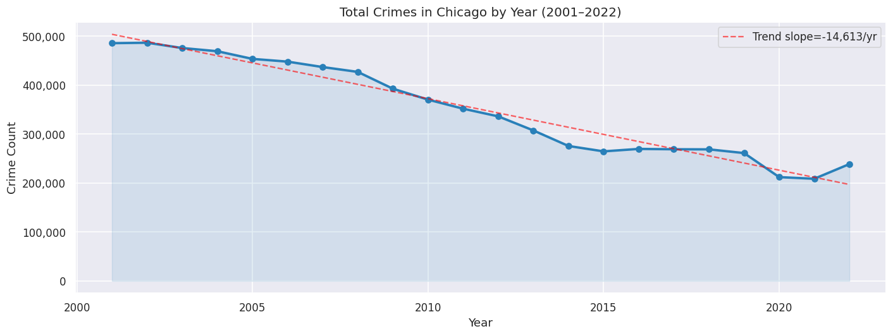
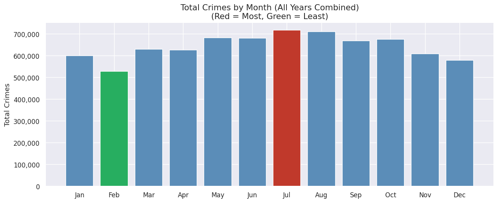
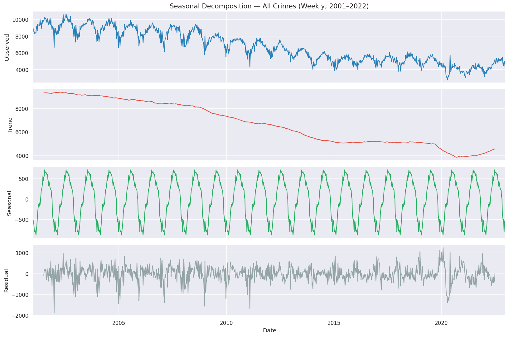
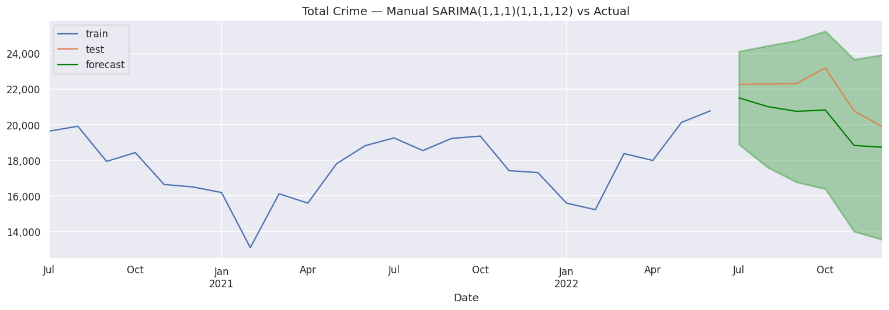
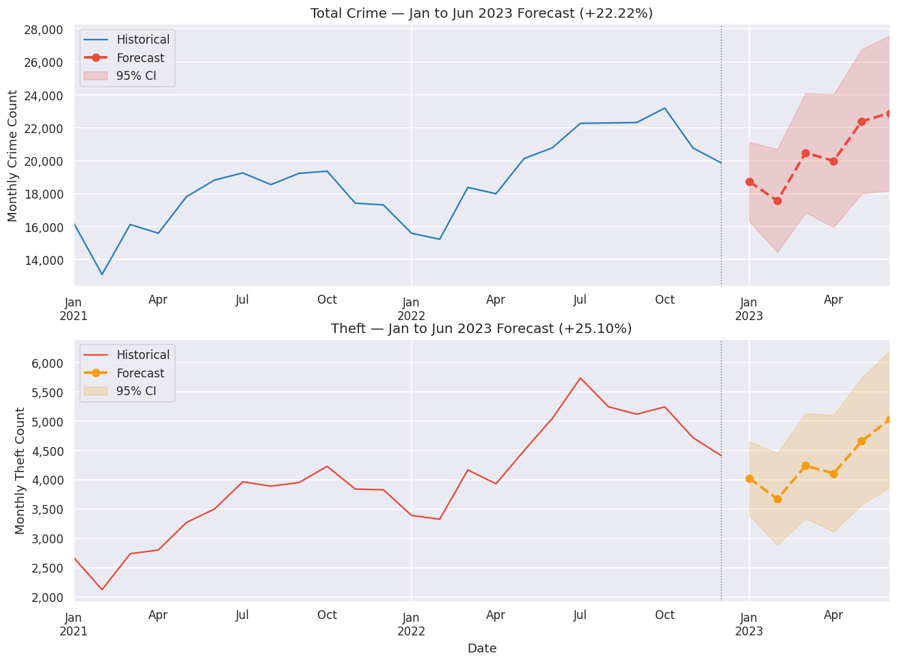

# Chicago Crime Analysis (2001–2022)
### Project 3 — Part 1 & Part 2 | EDA, Time Series & SARIMA Forecasting

---

## Project Overview

This project performs a comprehensive Exploratory Data Analysis (EDA), Time Series Analysis, and crime count forecasting on the Chicago Crime Dataset (2001–2022), covering over **7.7 million crime records**.

**Part 1** answers real-world stakeholder questions for a local newspaper reporter on crime trends, geographic distribution, temporal patterns, and seasonal cycles.

**Part 2** extends the analysis by building SARIMA forecasting models for **Total Crime** and **Theft**, producing 6-month forecasts (January–June 2023) to help Chicago law enforcement make data-driven resource allocation decisions.

---

## Dataset

| Property | Detail |
|---|---|
| Source | [Chicago Data Portal — Crimes 2001 to Present](https://data.cityofchicago.org/Public-Safety/Crimes-2001-to-Present/ijzp-q8t2) |
| Format | 22 CSV files (one per year), packaged in a ZIP archive |
| Total Records | 7,713,109 rows |
| Date Range | January 1, 2001 — December 31, 2022 |
| Key Columns | `Date`, `Primary Type`, `Description`, `Location Description`, `Arrest`, `Domestic`, `District`, `Ward`, `Latitude`, `Longitude` |

---

## Project Structure

```
chicago_crime_analysis.ipynb    <- Part 1: EDA & Time Series Analysis
chicago_crime_part2.ipynb       <- Part 2: SARIMA Forecasting
images/                         <- Key plot screenshots
README.md                       <- Project documentation (this file)
```

---

## Libraries Used

```
pandas          Data loading, cleaning, groupby, resampling
numpy           Numerical operations and trend slopes
matplotlib      Charts, forecast plots, and visualizations
seaborn         Statistical plots with styling
statsmodels     seasonal_decompose, SARIMAX, adfuller, plot_acf, plot_pacf
pmdarima        auto_arima hyperparameter tuning
sklearn         MAE, RMSE evaluation metrics
holidays        US/Illinois holiday calendar
gdown           Google Drive ZIP download
zipfile / os    ZIP extraction and file handling
```

---

# Part 1 — EDA & Time Series Analysis

## Workflow Summary

**Step 0 — Import Libraries**
All required libraries imported; seaborn theme and matplotlib rcParams configured.

**Step 1 — Load Data from Google Drive**
ZIP file downloaded directly from Google Drive using `gdown`, then all 22 CSV files read in-memory from the archive using `zipfile` and concatenated with `pd.concat`.

**Step 2 — Clean & Prepare Data**
- Parsed `Date` column to datetime with `errors='coerce'`; dropped unparseable rows (0 found)
- Set `Date` as index and sorted chronologically
- Engineered features: `Year`, `Month`, `Hour`, `date_only`
- Built two data forms:
  - **Form 1:** Individual crime rows with datetime index (each row = 1 crime)
  - **Form 2:** Daily crime counts via `.resample('D').size()`

---

## Topics Analyzed

### Topic 1 — Comparing Police Districts (2022)

**Key Findings:**

| | District | Crime Count |
|---|---|---|
| Most | District 8 | 14,805 crimes |
| Least | District 31 | 15 crimes |

---

### Topic 2 — Crimes Across the Years

**Key Findings:**
- Overall trend: **DECREASING** — from ~486,000 crimes (2001) to ~239,000 (2022), nearly a 50% reduction
- Linear regression confirms a slope of approximately -14,600 crimes/year



Crime types with an **increasing** trend while overall crime decreases:

| Crime Type | Pattern |
|---|---|
| Weapons Violation | Sharp increase, especially post-2015 |
| Deceptive Practice | Steady upward trend |
| Criminal Sexual Assault | Gradual rise |
| Stalking | Emerging upward trend |
| Concealed Carry License Violation | Sharp recent increase |

---

### Topic 3 — AM vs PM Rush Hour

**Key Findings:**

| Period | Total Crimes |
|---|---|
| AM Rush | 770,651 |
| PM Rush | 1,206,353 (more common) |

PM Rush has approximately **57% more crimes** than AM Rush.

| Rank | AM Rush | PM Rush |
|---|---|---|
| 1 | Theft | Theft |
| 2 | Battery | Battery |
| 3 | Criminal Damage | Criminal Damage |
| 4 | Burglary | Narcotics |
| 5 | Other Offense | Assault |

Motor Vehicle Theft: AM Rush 41,578 vs PM Rush 53,716 — **more common in PM Rush**

---

### Topic 4 — Comparing Months

**Key Findings:**

| | Month | Crime Count |
|---|---|---|
| Most | July | ~717,000 |
| Least | February | ~529,000 |



Crime types that **peak in winter** (counter-seasonal, winter/summer ratio >= 0.85):
- Offense Involving Children, Obscenity, Deceptive Practice, Narcotics, Criminal Trespass, Other Offense, Prostitution, Motor Vehicle Theft, Kidnapping

---

### Topic 5 — Comparing Holidays

**Top 3 Holidays by Crime Count:**

1. New Year's Day
2. Independence Day
3. Labor Day

Theft ranks #1 on New Year's Day, but **Battery** ranks #1 on both Independence Day and Labor Day. Criminal Damage is consistently #3 across all three.

---

### Topic 6 — Seasonality & Cycles

**All Crimes (Weekly):**

| Property | Value |
|---|---|
| Cycle Length | ~52 weeks (annual) |
| Seasonal Magnitude | ~1,600 crimes/week |
| Trend | Steady decline through 2015, then stabilizing |

**Motor Vehicle Theft (Weekly):**

| Property | Value |
|---|---|
| Cycle Length | Annual (52 weeks) |
| Seasonal Magnitude | ~55 thefts/week |
| Trend | Long-term decline until 2015, sharp increase post-2020 |



---

## Part 1 Summary Table

| Topic | Key Finding |
|---|---|
| Districts | District 8 had the most crimes (14,805); District 31 the least (15) in 2022 |
| Yearly Trend | Overall crime nearly halved from ~486K (2001) to ~239K (2022) |
| Rush Hour | PM Rush has 57% more crimes than AM Rush; Motor Vehicle Theft also peaks in PM |
| Monthly | July peaks; February lowest — winter-leaning types include Narcotics, Deceptive Practice, and Motor Vehicle Theft |
| Holidays | New Year's Day, Independence Day, Labor Day are top 3 — Theft tops New Year's Day, Battery tops the other two |
| Seasonality | Strong annual cycle (~1,600 weekly swing); Motor Vehicle Theft shows a concerning recent surge |

---

# Part 2 — SARIMA Forecasting

## Forecasting Methodology (Applied to Both Crime Types)

### 1. Monthly Time Series
Both series built using `.resample('MS').size()`. Zero null values confirmed for both.

### 2. Seasonal Decomposition
`seasonal_decompose()` with `model='additive'` and `period=12` confirmed strong annual seasonality in both series.

- Total Crime seasonal magnitude: **8,898 crimes/month**
- Theft seasonal magnitude: **2,550 thefts/month**

### 3. Stationarity Testing (ADF)

| Series | Raw | d=1 | D=1 (s=12) | d=1, D=1 |
|---|---|---|---|---|
| Total Crime | Non-stationary (p=0.617) | Stationary (p=0.031) | Non-stationary (p=0.067) | Stationary (p=0.000) |
| Theft | Non-stationary (p=0.585) | Stationary (p=0.002) | Stationary (p=0.002) | Stationary (p=0.000) |

**Decision:** Apply d=1 and D=1 for both series.

### 4. ACF & PACF Analysis
Both series showed spikes at lag 1 in ACF and PACF, and seasonal spikes at lag 12.
**Manual order selected: SARIMA(1,1,1)(1,1,1,12)**

### 5. Train / Test Split
- Train: January 2001 — June 2022 (258 months)
- Test: July 2022 — December 2022 (6 months)

---

## Results

### Total Crime

| Model | MAE | RMSE | MAPE |
|---|---|---|---|
| Manual SARIMA(1,1,1)(1,1,1,12) | 1,505 | 1,595 | 6.89% |
| auto_arima (2,1,1)(2,1,1,12) | 1,623 | 1,730 | 7.43% |

**Selected model: Manual SARIMA(1,1,1)(1,1,1,12)**



**True Future Forecast (Jan–Jun 2023):**

| Month | Forecasted Count |
|---|---|
| January 2023 | 18,731 |
| February 2023 | 17,571 |
| March 2023 | 20,482 |
| April 2023 | 19,991 |
| May 2023 | 22,394 |
| June 2023 | 22,893 |

**Net change: +4,162 crimes | Percent change: +22.22%**

---

### Theft

| Model | MAE | RMSE | MAPE |
|---|---|---|---|
| Manual SARIMA(1,1,1)(1,1,1,12) | 178 | 237 | 3.57% |
| auto_arima (0,1,1)(2,1,2,12) | 235 | 318 | 4.74% |

**Selected model: Manual SARIMA(1,1,1)(1,1,1,12)**

**True Future Forecast (Jan–Jun 2023):**

| Month | Forecasted Count |
|---|---|
| January 2023 | 4,024 |
| February 2023 | 3,670 |
| March 2023 | 4,237 |
| April 2023 | 4,109 |
| May 2023 | 4,658 |
| June 2023 | 5,035 |

**Net change: +1,011 thefts | Percent change: +25.10%**

---

## Final Evaluation

| Question | Answer |
|---|---|
| Highest monthly count at end of forecast (Jun 2023) | **Total Crime** (22,893 vs 5,035) |
| Highest net change by end of forecast | **Total Crime** (+4,162 vs +1,010) |
| Highest percent change by end of forecast | **Theft** (+25.10% vs +22.22%) |



---

## Final Recommendations

1. **Scale up patrol resources from April onward.** Both Total Crime and Theft begin their seasonal climb in March/April. Pre-positioning officers before the peak is more effective than reacting in June.

2. **Prioritize Theft prevention in May and June.** Theft shows the steeper percent increase (+25.10%) and is historically the most common crime type. Targeted patrols in high-density commercial areas and District 8 are recommended.

3. **Reduce patrol intensity in January and February.** Both forecasts show a clear winter trough. Resources freed during these months can be redirected to training or community outreach.

4. **Monitor Motor Vehicle Theft separately.** MVT showed a sharp post-2020 surge, a counter-seasonal winter-leaning pattern, and a PM Rush peak across Part 1. It warrants its own dedicated forecast and resource plan.

---

## How to Run

**Part 1:**
```bash
pip install pandas numpy matplotlib seaborn statsmodels holidays gdown
```
Open `chicago_crime_analysis.ipynb` and run all cells top to bottom.

**Part 2:**
```bash
pip install pandas numpy matplotlib seaborn statsmodels pmdarima scikit-learn gdown
```
Open `chicago_crime_part2.ipynb` and run all cells top to bottom.

The Google Drive link is already configured in both notebooks. No path changes needed.

---

## Author

**Mohammed Husein**
Computer Engineering Graduate | Data Science & ML Bootcamp — Axsos Academy
[GitHub](https://github.com/mohammedh897) | [LinkedIn](https://linkedin.com/in/mohd-husein/)
